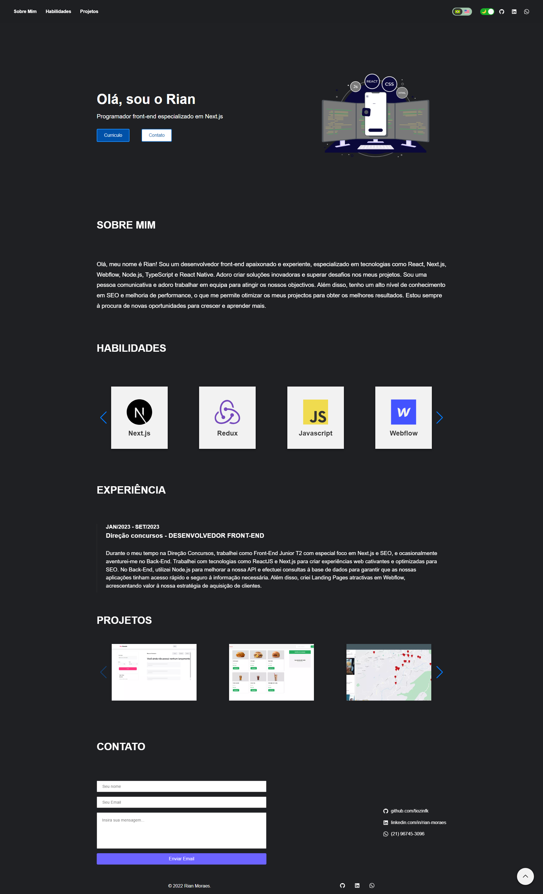

# Portfólio




> Este projeto é a materialização da minha jornada e conquistas. Aqui, cada linha de código e cada design cuidadosamente elaborado são testemunhos do meu compromisso com a excelência. Explore e descubra a essência do meu trabalho.


## 💻 Pré-requisitos

Antes de começar, verifique se você atendeu aos seguintes requisitos:

* Você instalou a versão mais recente de `Node`
* Você tem uma máquina `Windows / Linux / Mac`.

## 🚀 Instalando Portfólio

Para instalar o Portfólio, siga estas etapas:

Linux e macOS:
```
https://github.com/rshmdev/portfolio.git
```

## ☕ Usando Portfólio

Para usar Portfólio, siga estas etapas:

Npm:
```
npm i
```

Yarn:
```
yarn install
```

# Inicie o projeto

Yarn:

```
yarn start 
```
 
Npm
```
npm start 
```

Esse projeto está sob licença. Veja o arquivo [LICENÇA](LICENSE.md) para mais detalhes.
